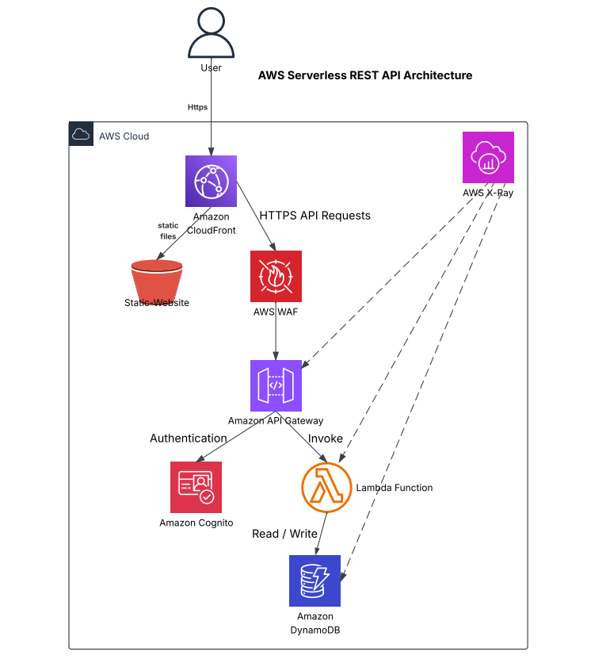

# AWS Serverless REST API

A serverless REST API architecture built on AWS using managed services such as Amazon API Gateway, AWS Lambda, Amazon DynamoDB, Amazon Cognito, AWS WAF, Amazon CloudFront, Amazon S3, and AWS X-Ray.

This project demonstrates how AWS serverless services can be combined to build a scalable, secure, and cost-effective REST API for managing customer records.

---

# Architecture Diagram



---

# AWS Services Used

| Service | Purpose |
|---------|---------|
| Amazon API Gateway | Exposes REST API endpoints |
| AWS Lambda | Executes CRUD operations |
| Amazon DynamoDB | Stores customer records |
| Amazon Cognito | User authentication using JWT |
| AWS WAF | Protects the API from common web attacks |
| Amazon CloudFront | Delivers content globally |
| Amazon S3 | Hosts the static frontend |
| AWS X-Ray | Monitors and traces requests |

---

# REST API Endpoints

| Method | Endpoint | Description |
|---------|----------|-------------|
| GET | /records | Retrieve all records |
| POST | /records | Create a new record |
| PUT | /records/{id} | Update an existing record |
| DELETE | /records/{id} | Delete a record |

---

# Architecture Flow

1. The user accesses the application through Amazon CloudFront.
2. CloudFront serves the frontend files stored in Amazon S3.
3. API requests pass through AWS WAF for protection.
4. Amazon API Gateway receives client requests.
5. Amazon Cognito authenticates users using JWT tokens.
6. AWS Lambda executes the requested CRUD operation.
7. Amazon DynamoDB stores or retrieves customer records.
8. AWS X-Ray traces the request across API Gateway, Lambda, and DynamoDB.

---

# Project Structure

```
aws-serverless-rest-api/
│
├── architecture/
│   └── architecture-diagram.png
│
├── docs/
│   ├── architecture-notes.md
│   ├── api-spec.md
│   ├── cache.md
│   ├── cloudfront.md
│   ├── cognito.md
│   ├── dynamodb.md
│   ├── iam.md
│   ├── s3.md
│   └── waf.md
│
├── lambda/
│   ├── create.py
│   ├── read.py
│   ├── update.py
│   ├── delete.py
│   ├── requirements.txt
│   └── event.json
│
├── README.md
│
└── .gitignore
```

---

# DynamoDB Table

**Table Name**

```
Records
```

**Primary Key**

```
id
```

**Attributes**

- id
- name
- email

---

# Security Features

- Amazon Cognito User Pool authentication
- JWT authorization through API Gateway
- AWS WAF managed rule groups
- Rate limiting
- Protection against common web attacks

---

# Monitoring

AWS X-Ray provides end-to-end distributed tracing across:

- API Gateway
- AWS Lambda
- Amazon DynamoDB

---

# Lambda Functions

| File | Description |
|------|-------------|
| create.py | Creates a new record |
| read.py | Retrieves records |
| update.py | Updates an existing record |
| delete.py | Deletes a record |

---

# Technologies

- Python 3.x
- AWS Lambda
- Amazon API Gateway
- Amazon DynamoDB
- Amazon Cognito
- AWS WAF
- Amazon CloudFront
- Amazon S3
- AWS X-Ray
- boto3

---

# Future Improvements

- API Gateway Response Caching
- Usage Plans and API Keys
- DynamoDB Streams
- Global Secondary Indexes (GSI)
- CloudWatch Monitoring
- CI/CD using GitHub Actions

---

# Author

AWS Serverless REST API Architecture Project
